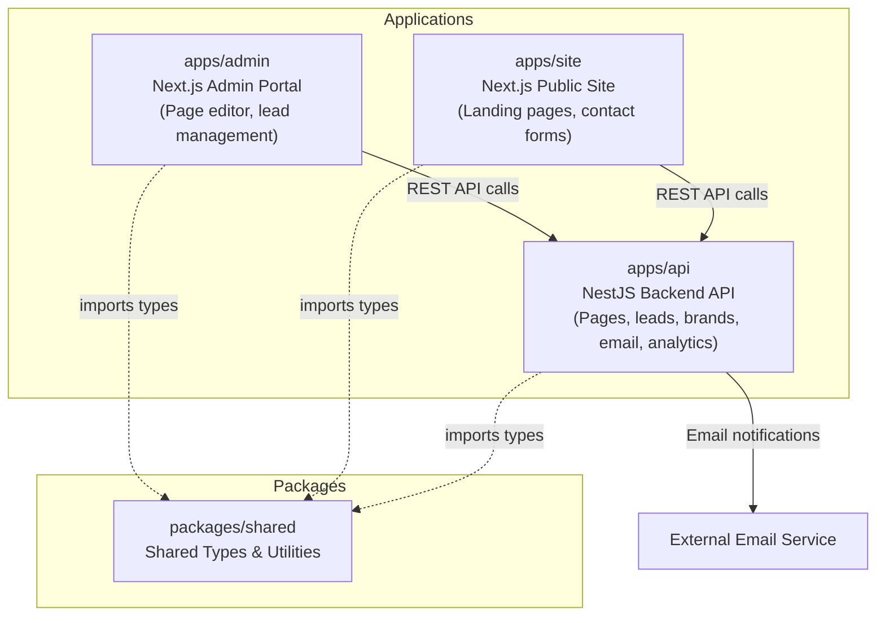

# Publication Platform — Engineering Assessment

## Assessment Overview

You're joining a team maintaining a brand publication and lead management platform. The codebase has been under active development with high feature velocity. Some areas have accumulated structural debt.

This is a **video-based live assessment**. You will share your screen, narrate your thinking, and work through the tasks below. The entire session is recorded.

**AI tools are permitted and encouraged**, but you must narrate what you accept, reject, and verify from AI output. Treating AI as an oracle rather than a tool is a negative signal.

## Architecture



| App | Responsibility |
|-----|----------------|
| `apps/api` | NestJS backend — pages CRUD, lead capture, brand management, email dispatch, analytics tracking |
| `apps/admin` | Next.js admin portal — page editor, lead management dashboard, brand configuration |
| `apps/site` | Next.js public site — renders landing pages, deep dives, contact forms for lead capture |
| `packages/shared` | Shared TypeScript types and utilities consumed by all three apps |

## Setup Instructions

```bash
cp .env.example .env
pnpm install
pnpm dev
```

| Service | URL | Description |
|---------|-----|-------------|
| Admin | http://localhost:3000 | Admin portal |
| API | http://localhost:3001 | Backend REST API |
| Site | http://localhost:3002 | Public site |
| pgAdmin | http://localhost:5050 | PostgreSQL Admin UI |

## Environment Variables

Use `.env.example` as the baseline.

| Variable | App | Required | Purpose |
|----------|-----|----------|---------|
| `PORT` | API | No | API port (default `3001`) |
| `DATABASE_URL` | API | Yes (for persistence) | PostgreSQL connection string |
| `CORS_ORIGINS` | API | No | Comma-separated allowed origins |
| `PLATFORM_ANALYTICS_KEY` | API | No | Enables analytics forwarding |
| `NEXT_PUBLIC_API_URL` | Admin + Site | Yes | Browser-visible API base URL |
| `NEXT_PUBLIC_SITE_URL` | Site | No | Public site URL used by metadata |
| `PGADMIN_DEFAULT_EMAIL` | pgAdmin | No | pgAdmin login email |
| `PGADMIN_DEFAULT_PASSWORD` | pgAdmin | No | pgAdmin login password |

## Testing

Run all test suites:

```bash
pnpm test
```

Run browser e2e (admin-to-site journey):

```bash
pnpm e2e
```

Run API tests only (unit + integration + e2e):

```bash
pnpm --filter @publication/api test
```

Run site unit tests only:

```bash
pnpm --filter @publication/site test
```

## Implemented Assessment Outcomes

- Fixed cross-page section corruption when cloning from templates by deep-copying sections and section content.
- Updated section editing to use copy-on-write semantics to avoid accidental shared-object mutation.
- Implemented UTM capture in the public contact form and persisted values in lead metadata.
- Prevented UTM data from leaking into user-visible lead notes.
- Added automated unit, integration, and end-to-end tests for these flows.

## Production Build and Deployment

Build all applications:

```bash
pnpm build
```

Start each app in production mode locally:

```bash
pnpm --filter @publication/api start
pnpm --filter @publication/admin start
pnpm --filter @publication/site start
```

Containerized deployment:

```bash
docker compose build
docker compose up -d
```

Initialize database schema locally:

```bash
pnpm db:push
```

Default local DB credentials used by docker compose:

- Host: `localhost`
- Port: `5433`
- Database: `publication`
- User: `publication`
- Password: `publication`
- pgAdmin login password: `Raju2006`

See `docker-compose.yml` and app-level `Dockerfile`s for deployment configuration.

## Submission Readiness Checklist

- Persistent PostgreSQL storage for brands, pages, and leads is implemented.
- UTM capture is stored in lead metadata and excluded from visible notes.
- Cross-page section corruption from template cloning is fixed.
- API tests include unit, integration, and HTTP e2e coverage.
- Frontend browser e2e covers admin creation flow through site lead submission.
- CI enforces lint, test, build, browser e2e, and container vulnerability scan.

## Assessment Flow (Video-Based)

### Phase 1 — Exploration (15 min)

Read the codebase on screen. Think aloud. Produce a **diagnosis memo** covering:

- Architecture sketch — how the pieces fit together
- Likely hotspots — where problems concentrate
- Suspected root causes — what mechanisms produce the reported bugs
- Risk areas — what could break next

**No coding in this phase.** The goal is to demonstrate that you build a mental model before touching code.

### Phase 2 — Implementation (45-60 min)

Fix the bug. Add the feature. Refactor where your judgment says it is needed. Narrate your decisions as you work.

### Phase 3 — Defense (15-20 min)

Explain what you did, what you left untouched, and what risks remain. Describe how you used AI tools and what you accepted or rejected from their suggestions.

## Problem Statement

### Bug Report

> Users report that editing content sections on one landing page sometimes corrupts content on a completely different page. This happens most often when pages were created from a template. The issue is intermittent and hard to reproduce in dev.

### Feature Request

> Add UTM parameter capture to the public site contact form. When a visitor arrives via a marketing link (e.g., `?utm_source=google&utm_medium=cpc`), the UTM values should be stored with the lead record so brand managers can see which campaigns drive leads. UTM data should NOT appear in user-visible notes.

These are the primary tasks, but a strong candidate will identify and address related issues they discover during exploration.

## Evaluation Criteria

See [docs/EVALUATION-CRITERIA.md](docs/EVALUATION-CRITERIA.md) for the full rubric.

## Rules

- **Time limit**: 90 minutes total
- **AI usage**: Permitted. You MUST narrate what you accept, reject, and verify from AI suggestions.
- **Scope**: You are not expected to fix everything. Prioritize what matters most.
- **Refactoring**: You may refactor, but explain why.

## Additional Documentation

- [Architecture Guide](docs/ARCHITECTURE.md)
- [Evaluation Criteria](docs/EVALUATION-CRITERIA.md)
- [Submission Guide](docs/SUBMISSION.md)
