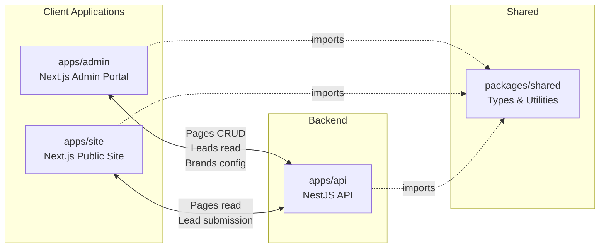
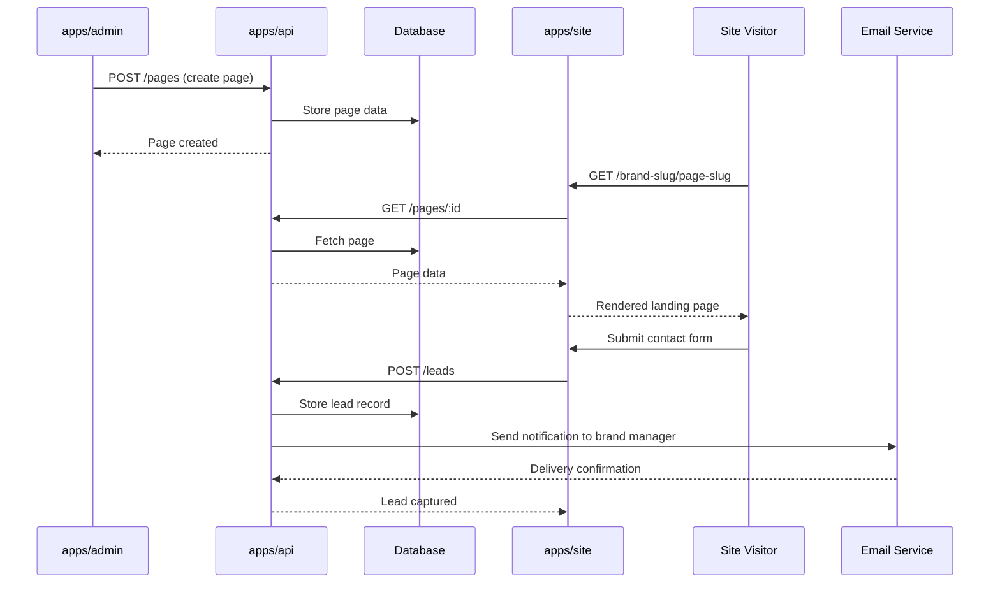
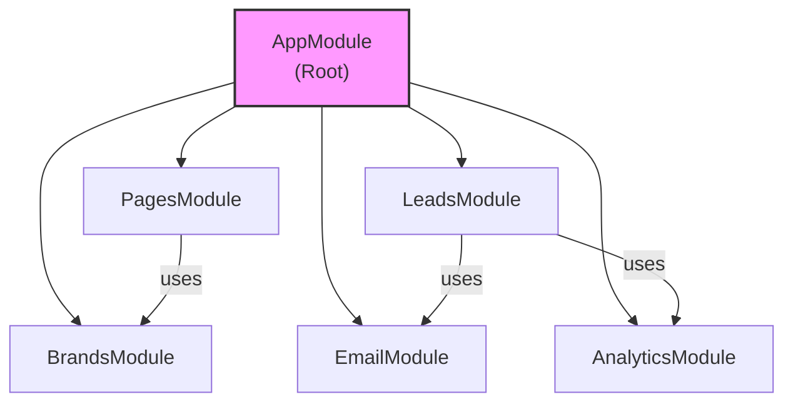
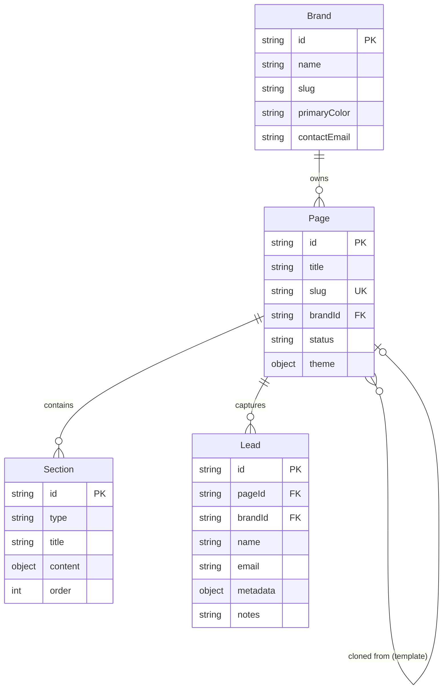
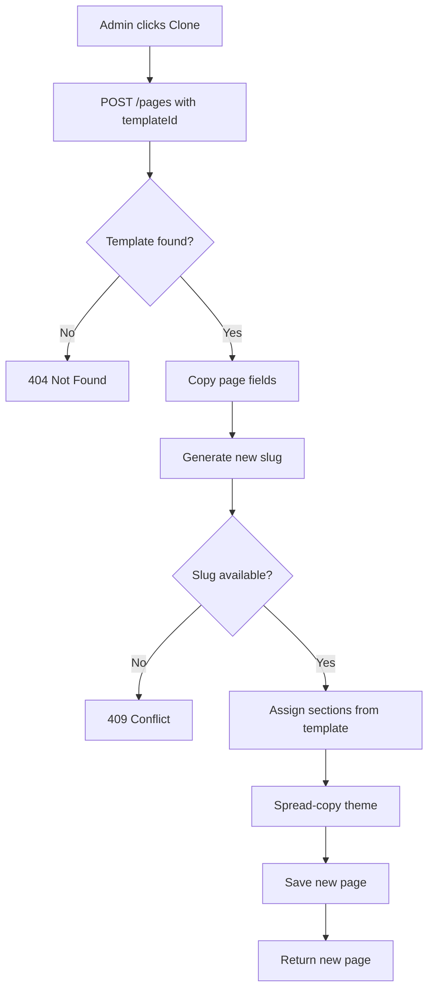

# Architecture Guide

## System Overview

The platform consists of three applications and a shared types package, arranged as a pnpm monorepo managed by Turborepo.

- **apps/admin** — Internal admin portal built with Next.js. Brand managers use it to create and edit landing pages, manage leads, and configure brand settings.
- **apps/site** — Public-facing site built with Next.js. Renders landing pages and deep dives for visitors. Hosts contact forms that capture leads.
- **apps/api** — NestJS backend providing REST endpoints for all data operations. Handles page storage, lead capture, brand management, email dispatch, and analytics.
- **packages/shared** — TypeScript type definitions and utility functions shared across all three apps. Provides the contract between frontend and backend.

## Data Flow

## Module Dependency

The NestJS API is organized into five modules. Each module encapsulates a domain concern.

### Module Responsibilities

| Module | Responsibility |
|--------|----------------|
| **PagesModule** | CRUD operations for landing pages. Manages page content, templates, and brand associations. Depends on BrandsModule for brand validation. |
| **LeadsModule** | Lead capture and management. Processes contact form submissions, stores lead records, triggers email notifications and analytics events. |
| **BrandsModule** | Brand configuration and management. Stores brand settings, slugs, and metadata. Provides brand lookup used by other modules. |
| **EmailModule** | Email dispatch service. Sends notification emails to brand managers when new leads arrive. Consumed by LeadsModule. |
| **AnalyticsModule** | Event tracking and analytics. Records page views, form submissions, and other user interactions. Consumed by LeadsModule. |

## Shared Types Package

The `packages/shared` package (`index.ts`, `types.ts`) defines the TypeScript interfaces and DTOs shared between all three applications. This ensures that API request/response shapes, entity types, and utility functions stay consistent across the frontend and backend without manual synchronization.

Changes to shared types propagate to all consumers at build time via Turborepo's dependency graph.

## Key Data Entities

## Template Cloning Flow

When a page is created from a template, the system copies the template page's properties into a new page. The sections and theme are carried over to give the new page the same structure as the template.

